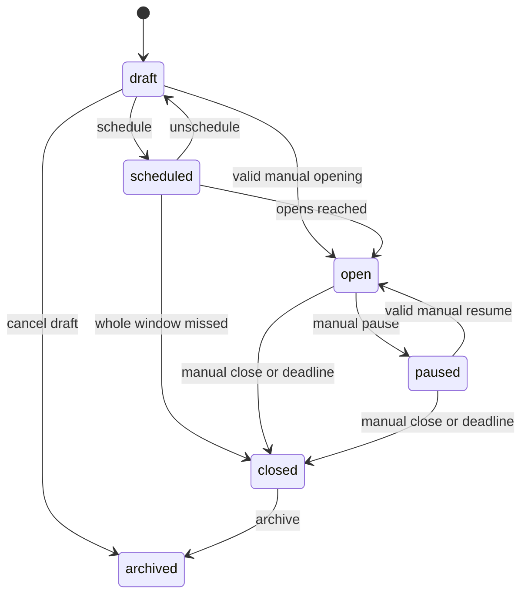

# Fasa 7.0 — Campaign Engine Architecture Lock

8 October 2026 (+08:00). **Owner-approved architecture; Fasa 7.0 complete.**
Overall architecture and the three decisions in section 22 are locked. Fasa 7
remains in progress/not complete; 7.1–7.6 and 7.C have not begun. Implementation
requires separate authorization; approval of this document does not start 7.1.
This documentation checkpoint updates the plan and ROADMAP only. Owner authorizes
commit/push to canonical main and tag `phase-7.0-campaign-engine-architecture`;
resolve that tag for the checkpoint commit. No runtime, schema, migration,
configuration, CMS write, resource mutation or deployment is authorized.

## 1. Objective

Design a reusable Campaign Engine: **generic campaign foundation + typed domain
modules**. The foundation manages identity, lifecycle, scheduling, visibility,
module flags and governance. Each domain owns its rules and operational records.
It is not an arbitrary form builder: no administrator-defined executable fields,
workflow expressions, payment rules or unrestricted JSON business logic.

Future examples include Qurban/Aqiqah, volunteer recruitment and Ramadan
sponsorship/donations. Their requirements inform extension boundaries, not a
final domain schema or permission to implement them. Kelas Mengaji is a separate
future operational module, not a campaign type.

## 2. Current architecture verified from the repository

Pre-edit audit: clean `main`, HEAD and local `origin/main` at
`69fa6c973686de56933d452d32f28807551a8674`; completion tag resolves to that commit.
Remote main/tag synchronization was verified at the preceding checkpoint; this
planning audit did not re-read hosted databases or treat old counts as live state.

| Verified baseline | Repository evidence and consequence |
| --- | --- |
| Fasa 6.1/6.1A/6.1B-1/6.1B-2/6.1B-2R complete; Fasa 7 not started | [ROADMAP](ROADMAP.md), [project state](PROJECT-STATE.md), [final hosted recovery evidence](ADMIN-FOUNDATION-MFA-RECOVERY-VERIFICATION.md). Earlier open-phase text is historical. This document begins planning only. |
| Next.js App Router | `package.json`: Next 16.3.6, React 19.2.8; `/admin` and public pages share the application but have separate boundaries. No new framework/dependency is proposed. |
| Verified SSR/DAL | `src/lib/admin/dal.ts` verifies Auth claims and getUser, then reads DB security state; `src/lib/supabase/server.ts` uses pinned SSR 0.12.7 / supabase-js 2.117.2 and publishable key. No normal runtime service-role key. |
| Live database authority | The sole reviewed migration `supabase/migrations/20261006000100_admin_foundation.sql` binds Google identity/email, live membership and live Auth session. Disabled/revoked membership and terminated sessions deny access despite a JWT. |
| Three foundation tables | `public.admin_profiles`, `private.admin_invites`, `private.admin_audit_log`; no campaign, flag, registration or future module tables. |
| Existing roles/MFA | super_admin/admin/staff; super_admin needs verified TOTP/AAL2 operationally and signed recent TOTP evidence within 600 seconds for privileged foundation mutations. Admin/staff may use AAL1; an enrolled TOTP factor also makes AAL2 necessary in current policy. |
| Existing mutation scope | `policy.ts` mode `mutation` and SQL `private.require_owner(true)` are super_admin-only. They cannot be reused unchanged to allow admin campaign mutations. Access management remains owner-only. |
| Audit limitations | Audit is append-only and successful mutations audit atomically. Existing action/status checks and `record_event` are foundation-specific; null actors are currently allowed only for bootstrap/recovery. Campaign/scheduler events do not fit unchanged. |
| Studio/editorial ownership | `/studio` uses Sanity authentication, separate from Supabase membership. `src/sanity/schemaTypes/program.ts` is descriptive public programme content, with optional external registration URL; it is not an operational campaign. |
| Published public content | `src/lib/public-content/cms/server.ts` reads published Sanity without a token, caches editorial reads for 300 seconds and uses explicit adapters/fallbacks. This cache/fallback cannot become authority for campaign admission. |
| Route isolation | `app-route-layout.tsx` and `isIsolatedRoute` exclude `/admin` and `/studio` from public transition retention. `src/proxy.ts` refreshes only `/admin`; cookies are scoped to `/admin`. Keep these boundaries. |
| Engine absent | No campaign route, engine service, system flag entity or scheduler is implemented in the inspected application/migration. Editorial/gallery category labels do not implement those features. |

### Compatibility findings before editing

There is no conflict with the owner's hybrid model or data ownership requirements.
Two genuine extension points need later reviewed changes: campaign capabilities
must allow admin without broadening foundation mutation privileges; audit must
gain campaign targets/events and a narrowly attributable scheduler actor.

The [approved foundation plan](ADMIN-FOUNDATION-PLAN.md) anticipates module
capabilities and a possible controlled capability-grant table with a real module.
For this foundation, derive the owner's fixed campaign permissions from live roles;
do not add arbitrary per-user grants or mosque-position roles. Domain-specific
grants can be reviewed with the first domain module if necessary.

## 3. Scope

Architecture contracts for campaign core, typed extensions, two-level feature
controls, lifecycle/scheduler, administrative authorization, public metadata
gating, safe audit integration and future compatibility. Specify conceptual
entities, implementation sequence and acceptance gates without executable SQL.

## 4. Explicit non-scope

No implementation in 7.0. Fasa 7 implementation, when separately approved, remains
foundation only: no registration/customer/participant/volunteer/payment/receipt/
allocation/consent workflow, no Qurban or Ramadan domain logic, no Kelas Mengaji,
no form builder, no capability-assignment UI, no additional super_admin creation,
no owner bootstrap/recovery changes, and no migration of existing Sanity programmes.
No production provisioning, secrets in documents, pricing constants, hosted jobs
or permanent privileged scheduler credential is configured now.

## 5. Campaign core model

Conceptual fields, not a final SQL definition or permission to create tables:

| Concept | Contract |
| --- | --- |
| `id` | Immutable opaque UUID; stable relationship key across modules and editorial binding. |
| `type` | Controlled discriminator from a reviewed type registry, not arbitrary administrator text. Qurban/Ramadan examples are future types, not implemented modules. |
| `slug` | Unique normalized URL-safe slug, lowercase bounded format; reserve system names. Editable in draft only by default; stable after first public exposure. Never reuse an archived slug for another campaign. |
| `title` | Bounded plain-text operational display name; rich introduction belongs to Sanity. |
| `status` | draft/scheduled/open/paused/closed/archived; authoritative stored lifecycle. |
| Registration dates | Optional opens/closes instants; scheduled requires opens; when both are supplied, closes must be later than opens. Manual opening must also precede any close deadline. Null closes explicitly means manual closure, not an invented deadline. |
| Event dates | Optional event starts/ends, independently validated. An event ending is not itself a registration/payment/refund rule. |
| Timezone | Store instants in UTC; display/enter in explicit Asia/Kuala_Lumpur. Reject ambiguous local strings and date rollover. Future date-only sponsorship days remain domain dates. |
| Visibility | private/public/unlisted plus explicit scheduled-page and archived-history opt-ins. Private means no public DTO; unlisted is publicly addressable but excluded from listings/indexing, not confidential. |
| Settings/configuration | Versioned, allowlisted core settings plus type-specific validated config; no PII, credentials or executable rules. No generic arbitrary form definitions. |
| Editorial binding | Optional stable published Sanity document ID and explicit type/project/dataset context; see section 12. Never join operational records by title or slug. |
| Metadata | Server-derived created/updated timestamp and actor ID; positive version for optimistic concurrency; schema/config version. Separate lifecycle occurrence times from planned dates. |

Immutable type after creation prevents reinterpreting domain rows under a different
validator. No hard-delete campaign operation in the foundation; archive instead.
Any future slug aliases/move operation needs an explicit reviewed migration and
redirect policy, not silent reuse. Calendar year/Hijri labels are presentation or
typed configuration, not an authorization or identity key.

## 6. Typed campaign extension model

Maintain a reviewed registry mapping type to module flag key, core/config validator,
configuration version and supported capabilities. TypeScript uses a discriminated
union; DB constraints/guarded functions also validate allowed keys, ranges and type
compatibility. Browser validation alone is insufficient.

Each future domain has its own typed operational relationships keyed to campaign
UUID. The campaign row does not become a universal bag of participants/payments.
Unknown type, unknown configuration version and unsupported actions fail closed;
new type support requires reviewed code/contracts, not toggling a flag.

Separate **core active campaign** from **domain registration readiness**. `open`
is a lifecycle state, not proof that a registration/payment module exists. Fasa 7
can provide validated descriptive campaign pages but no registration submission
or working operational CTA. A future domain admission handler additionally checks
its own availability/configuration and rules. Do not create dummy live modules to
demonstrate the engine; use isolated test descriptors/fixtures for QA only.

Volunteer recruitment may later be a separate typed campaign instance linked to
an event campaign. Volunteer participation can also reference the same Qurban
campaign directly. Neither arrangement makes volunteer a participant boolean.
Exact type keys and domain entities are reviewed when those modules are authorized.

## 7. Two-level feature flag architecture

**Locked permissions:** global/system module flags mutate only by super_admin;
individual campaigns are managed by super_admin/admin, staff read-only.

Level 1 is an allowlisted system flag registry: examples `campaigns.enabled`,
`qurban.enabled`, `ramadan.enabled`. A type maps to a required module key in trusted
registry data; callers cannot choose a less restrictive key. Defaults are disabled;
missing/unknown/unreadable flags deny effective availability. Enabling a flag does
not install a module or grant a role.

Level 2 is the campaign instance: identity, lifecycle, visibility, schedule and
validated settings. Do not add an `enabled` boolean as a substitute for lifecycle.
Administrative create/update is permitted while a module is off so drafts can be
prepared; require normal RBAC/audit regardless. An instance cannot bypass a global
flag. Re-enabling a module never resets a closed/paused instance.

Effective public display requires global campaigns flag, required module flag,
supported core descriptor, visibility and lifecycle eligibility. Future domain
admission additionally requires open status, current registration window, installed
domain capability and all domain conditions. Event time is not substituted for
registration time. These checks run again atomically at any future admission write.

**Locked: required global/module flag OFF is a true public kill switch.** Every
affected `/kempen/[slug]` returns safe 404, including closed/history pages; no
neutral public page survives that gate. The flag command does not change campaign
operational/history records or lifecycle, and authorized `/admin` inspection
remains available. Temporary public registration suspension uses lifecycle
`paused` with required flags ON, not global disable. Separately scheduled lifecycle
transitions still reconcile by their own due-time guards and audits while flags
are off; they are not side effects of flag mutation, and cannot restore public
availability. Future payment callbacks/recovery
of already-started transactions need independent domain rules; never blindly drop
a verified financial event because a system/module kill switch was disabled.

## 8. Lifecycle/state machine

Approved transitions; all require expected-version checks, typed validation and
atomic audit. Closed admission and archived terminality are locked in section 22.

| From | To | Trigger/guard |
| --- | --- | --- |
| draft | scheduled | Authorized manager, valid future opens date, valid configuration; no public admission. |
| draft | open | Authorized manager; opens is absent or due, close not expired; cannot override a future opens date without separately audited schedule change. |
| draft | archived | Cancel unused draft; never public unless historical publication requirements are met. |
| scheduled | draft | Explicit unschedule/cancel preparation with reason; removes scheduled public eligibility. |
| scheduled | open | Scheduler or authorized due-now open; current version/window checked inside transaction. |
| scheduled | closed | Scheduler discovers entire window already elapsed; record missed-window reason, not a fictional period of opening. |
| open | paused | Explicit manager pause with reason; schedules cannot implicitly resume it. |
| paused | open | Explicit resume; opens due and closes not passed; fresh authorization and current config. |
| open/paused | closed | Explicit manager close, or scheduler when close deadline is reached. Closing paused prevents a stale resume after expiry. |
| closed | archived | Authorized archival; no reopening or destructive deletion. |

**Locked: closed is terminal for admission; archived is terminal.** Closed may
transition only to archived, never to open/paused/scheduled/draft. A new programme
uses a new campaign instance. Paused may resume to open only through its stated
guards. No hidden developer override, scheduled/open boolean shortcut or arbitrary
status PATCH may bypass these rules, including for super_admin or the scheduler.
Changing dates does not implicitly resume paused/closed/archived campaigns.
Changing a due close to a past instant requires an explicit close command; schedule
edit and required transition must be one validated/audited transaction.

## 9. Scheduler behaviour

One authoritative transition service executes the same guarded transaction as
manual lifecycle operations, with a separate narrowly scoped system actor path.
The scheduler may only perform due transitions; no general campaign edit, profile
write, flag change, arbitrary actor impersonation or domain mutation privilege.

Use DB time and row/version checks; bounded batches with locking prevent overlapping
runs from performing a transition twice. Check close deadline first, including for
paused campaigns; then open eligible scheduled campaigns. Re-evaluate current
row under lock after competing manual updates. Retry after failure is idempotent:
already-transitioned rows do not add duplicate business audits. Actual processing
time and planned effective deadline are distinct audit fields.

Scheduler and manual transaction must serialize consistently. A last-second pause,
schedule edit or global disable cannot be overwritten from an old job snapshot.
Audit failure rolls back the lifecycle change. Catch-up closes missed windows
directly; no transient open and no invented retrospective acceptance period.

Correct admission never depends on the worker running on time: DB clock/window
checks deny at the close deadline even if stored status still says open. A delayed
scheduled opening remains unavailable until the transition commits. Public DTO
returns a truthful waiting/unavailable state, never an enabled form from old state.
Future type readiness is also checked before its operational actions.

Technical preference: a narrow database-side scheduled entry point if the selected
environment supports it; an authenticated server worker can invoke the same
restricted path otherwise. Actual scheduler provider, cadence, secret custody,
least-privilege execution role and retry/health monitoring are implementation gates
for 7.3, not assumed existing resources. Proposed target is reconciliation every
minute; verify hosted-plan capability/cost first. No browser timers or user JWT
stored for scheduled work. Deny unauthenticated scheduler endpoints.

## 10. RBAC and database authorization

Roles derive from current active membership and trusted bound Google identity,
not payloads, editable metadata, UI visibility or cached claims alone.

| Action | super_admin | admin | staff | Public visitor |
| --- | --- | --- | --- | --- |
| Read global flags in admin | Yes, AAL2 | Yes | Yes | No raw flag/config rows |
| Mutate global/system flags | Yes, AAL2 + recent MFA | Denied | Denied | Denied |
| Create/read/update campaign | Yes, AAL2; recent MFA on mutation | Yes | Read only | Eligible public DTO only |
| Manage lifecycle/schedule/visibility | Yes, AAL2 + recent MFA | Yes | Denied | Denied |
| Read operational campaign config | Yes | Yes | Read-only safe foundation config | Denied |
| Read foundation access audit/manage users | Existing owner-only rules | Denied | Denied | Denied |
| Read campaign audit projection | Yes, AAL2 | Safe campaign-only projection | Denied | Denied |
| Perform scheduled transitions | No user impersonation; separate narrowly authorized system principal | Not a delegated browser action | Denied | Denied |

Admin/staff inherit current MFA policy: AAL1 is allowed initially only where no
verified TOTP requires AAL2. Super_admin AAL1 remains confined to security/MFA,
never campaign operational access. No new admin step-up requirement is silently
invented; owner operations retain signed AMR/600-second recency.

Proposed capabilities: system.flags.read/manage and campaigns.read/manage. Server
authorization and DB guarded operations enforce the same matrix. Do not relax the
existing generic `mutation` owner guard or call `require_owner` as a substitute
for campaign-manager authorization. Introduce scoped campaign guards later;
foundation Users/invitation RPCs remain owner-only.

Enable deny-first RLS and explicit grants together on new entities. No direct
client INSERT/UPDATE/DELETE; authenticated users use narrow typed RPCs. Guarded
private implementations recheck live actor, permitted operation, MFA as applicable,
target/version and flags where required. Restrict EXECUTE, fixed search paths,
helper exposure and system identity; client-supplied actor IDs are never proof.
Public read is an explicitly approved projection, not broad table SELECT. Grants
and RLS are complementary database controls. [Supabase RLS guidance](https://supabase.com/docs/guides/database/postgres/row-level-security).

Mutations lock/recheck the active actor before committing. Define one lock order:
actor membership, relevant flag keys in sorted order, then campaign rows in sorted
UUID order. Scheduler skips the user-actor lock but follows the same remaining
order. Flag updates and future admission writes share the flag serialization point;
live membership/flag changes cannot be bypassed with a pre-transaction snapshot.

Use existing same-origin, bounded JSON input, no-store responses and generic
401/403 failures. Conflicting versions return 409; invalid dates/type/config return
422 at the application boundary. DB/flag dependency outage denies operation with
503, not a fabricated role, default enabled state or success message.

## 11. Canonical public `/kempen/[slug]` contract

No route is implemented now. This route is descriptive/gated in Fasa 7; operational
registration belongs to future domains. Evaluate operational eligibility first,
then resolve published editorial content. A visible page does not confer membership.

| State | Approved public behaviour when required flags are ON and visibility allows |
| --- | --- |
| draft | 404, excluded from listings/sitemap; even a published Sanity document cannot reveal a draft campaign. |
| scheduled | 200 with “Pendaftaran belum dibuka” only if instance explicitly allows scheduled public display; otherwise 404. No admission CTA. |
| open | 200 active campaign information. No working registration/payment CTA in Fasa 7. Future CTA requires domain capability plus current window/readiness. |
| paused | 200 neutral “Pendaftaran dihentikan sementara”; no new admission. Avoid revealing internal pause reason publicly. |
| closed | 200 read-only “Pendaftaran telah ditutup”; event information may remain. No new admission, implied refund or payment status. |
| archived | 200 historical read-only only with history opt-in and prior public eligibility; otherwise 404. No admission. |

Unknown slug and private visibility return 404. **Required global/module flag OFF
always returns safe 404 before lifecycle/history or editorial composition.** The
paused/closed/archived 200 behaviours above never override the kill switch. Unlisted pages
return the same safe state DTO but are omitted from listing/sitemap and noindexed.
Genuine dependency outage returns neutral unavailable/503; do not misreport outage
as a closed campaign or use fallback data to open it. No private config, actor IDs,
registration counts exposing persons or domain financial records in public DTOs.

Use a dedicated server-only anonymous/publishable-key read boundary that invokes
the narrow public projection, not the authenticated `/admin` cookie client or a
service-role query. It must not create public Auth sessions or broaden the proxy
matcher/cookie path. If exposed directly through PostgREST, the projection must
enforce identical filtering; no alternative API can retrieve raw private campaigns.

Operational state/flags are fresh/no-store initially. Editorial descriptions may
retain their published-only cache. Do not cache a merged active CTA/page for five
minutes after pause/disable; response caching and outgoing route retention must
not preserve obsolete actionable controls. Every future submission revalidates
DB state, even after a user kept an old tab open. Sanity text/image caching never
authorizes a transaction. Existing homepage/Kuliah caches remain unchanged.

## 12. Supabase versus Sanity responsibility boundary

| System of record | Owns | Must not decide |
| --- | --- | --- |
| Supabase/PostgreSQL | Campaign UUID/type/slug/lifecycle/window/visibility, flags, operational typed configuration, authorization and audits; future domain records | Rich editorial publication workflow or Sanity membership |
| Sanity `/studio` | Introduction, images/posters, FAQ, descriptive programme/event text and published editorial assets | Live admission, trusted prices/capacity, paid/verified state, access roles or lifecycle transitions |
| Next.js read adapter | Compose validated safe DTO with independently published editorial content | Duplicate operational authority or cross-system transactional success |

Bind by stable Sanity document ID stored against campaign UUID, with explicit
environment/project/dataset and expected document type. Do not derive the join
from either title or slug; changing editorial wording must not break operations.
Future editorial documents may carry campaign UUID for editor context, but Supabase
binding remains authoritative and validated. Cross-system references are not DB
foreign keys and have no distributed transaction guarantee.

7.5 may propose a minimal descriptive campaign editorial schema if existing
`program` cannot hold the approved content shape. The need for FAQ/rich content
does not authorize converting all `program` documents, changing their eligibility
or creating Sanity documents during 7.0. Any later schema/config/write is separately
reviewed and stays limited to editorial metadata, never operational domain tables.

Link/unlink/relink is an audited campaign update with expected version; validate
allowed dataset/type and published ID (reject draft/version IDs), and reject
conflicting ownership. Prefer at most one active binding per campaign and no
accidental shared campaign document. Published editorial can lag operational
closure without reopening it. Draft/absent/deleted/wrong-dataset content results
in a minimal operational title/state page where public eligibility permits, with
no domain admission CTA until required editorial/consent readiness is satisfied.
Malformed editorial data is omitted or unavailable, not blindly rendered.

Prices/units/capacity and authoritative dates remain operational. Public structured
values are rendered from validated operational projection; descriptive text that
mentions those values needs editorial review to avoid conflicting quotations.
Changing an editorial document cannot change accepted consent or financial terms.
Supabase membership does not grant Studio access, nor does Sanity membership grant
campaign management. No CMS token, PII or project secret appears in public clients.

## 13. Audit and security strategy

Reuse the existing **private append-only audit architecture**, not an independent
campaign logging system. In 7.1, propose a backward-compatible extension of
`private.admin_audit_log` and its guarded writer: allowlisted campaign/flag actions,
explicit target kind/UUID/key, sanitized event metadata, and an explicit system
actor category for scheduler transitions. Keep foundation fields/events, immutable
trigger and owner-only foundation audit reads intact; do not overload role/status
columns with incompatible campaign values or allow every null actor/action.

Event families include campaign.create/update, schedule.change, lifecycle.open/
pause/resume/close/archive and system_flag.enable/disable. Each successful mutation
records server-derived actor (user or restricted scheduler identity), actor AAL or
system category, target, action, server timestamp, request/correlation ID, expected
and resulting version, and safe before/after fields in the same DB transaction.

Use per-action metadata allowlists: flag boolean, campaign type, lifecycle, UTC
dates, visibility mode, config version or changed field names. No wholesale JSON
diffs, customer names/phones/emails, participant details, consent snapshots, bank/
receipt/payment payloads, Auth token, seed or free-text internal pause reasons.
Rejected attempts and worker errors use sanitized operational diagnostics separately;
rollback does not persist a successful business audit. Auth provider logs remain
separate from campaign governance events.

**Locked audit visibility:** super_admin can read campaign audit with existing
operational AAL2 requirements; admin can read only a safe campaign-only projection;
staff cannot read audit history. Foundation/access/security audit remains
super_admin-only. The admin projection must allowlist campaign event families and
safe fields on the server/database boundary, and exclude invitation/access-management
history, MFA/security events, foundation recovery events and sensitive PII/payment
data. Neither a browser-supplied audit scope nor direct RPC/Data API access may
broaden that projection to raw audit rows. Proposed retention inherits the
12-month target, not an implemented purge promise; privacy/backup/final retention
remain pre-production decisions. No client purge or destructive cleanup. Existing
12 staging audit rows and test identity/factors are not touched by this planning.

## 14. Future Qurban/Aqiqah compatibility requirements

Do not design final Fasa 8 tables here. The extension must preserve these boundaries:

- A registration/customer/contact can own multiple participations; payer/contact
  and the person performing ibadah may differ. No one-campaign-row/one-person rule.
- Participation has a typed Qurban/Aqiqah purpose. Future animal/capacity rules
  support cattle with seven shares and goats with one participation; these rules
  belong to the domain, not generic settings or a religious ruling invented here.
- Payments can be instalments. One payment can be attributed across several
  participations; several payments can fund one participation. Payment application,
  verification, balance and receipt are separate auditable domain concerns.
- Allocation eligibility comes from explicit domain conditions such as verified
  payment and consent, never merely registration time or campaign `open`.
- Group/family requests need an explicit stable request/group key and authorization;
  later registrations may request the same cattle. Never infer grouping solely
  from surname, free-text resemblance, payer identity or volunteer preference.
- Capacity reservation, eligibility and final allocation need domain concurrency
  guards and idempotency; closing a campaign does not erase unfinished fulfilment.
- Akad/consent needs versioned approved text, accepted timestamp and exact snapshot
  or immutable version reference under appropriate custody. Editorial edits cannot
  rewrite prior acceptance. The engine stores no participant consent blob.

Campaign UUID/type/lifecycle/config version are integration anchors. No final
allocation schema, prices, refund policy or approval workflow is fixed in 7.0.

## 15. Future Volunteer compatibility requirements

Volunteer is its own entity/domain, with its own registration/preferences/consent
and links. Support participant + volunteer, participant only and volunteer only;
neither participation nor verified payment is universally required to volunteer.
Do not assume public people have Supabase admin identities.

Future volunteer attributes may include name, phone, shirt size, work/team
preference, animal/group preference and WhatsApp consent/status. Keep these out
of campaign core, public DTOs and generic audit metadata. Record outreach consent
separately from operational status; messaging is not authorized by this plan.

A participant allocated to Lembu #2 may request volunteer work at Lembu #2.
Represent this as an explicit preference/reference, subject to assignment rules,
not a forced allocation, automatic shared membership or permission to see others'
personal data. Volunteer assignment and ibadah allocation remain independent.

## 16. Future Ramadan compatibility requirements

Ramadan is a typed domain with configurable, versioned sponsorship options.
The 2026 examples are compatibility inputs: daily iftar + moreh, sponsorship slots,
sahur and general Ramadan donation. They are not production prices or fixed enums
that forever determine future years.

Future option concepts: stable ID, name, price, currency, unit, capacity and
applicable dates. Store reviewed configuration operationally per campaign/year;
money uses an exact representation, not floating-point arithmetic. Domain commands
enforce capacity atomically and distinguish unlimited donation from limited slots.
Multiple daily dates/options do not require a campaign per day.

Payment and receipt records are operational, with domain verification and idempotency.
Preserve purchase/sponsorship terms snapshots so later price edits do not rewrite
past obligations. Sanity owns explanatory copy/images, not payable amount or slot
availability. No sponsorship checkout, slot pricing, receipt or payment integration
is implemented in Fasa 7.

## 17. Quran Class / Kelas Mengaji note

Kelas Mengaji is a **non-campaign future operational module**. Recurring class,
student/guardian, attendance, enrolment and teaching schedules may need separate
boundaries later; none are designed here. Do not place it in the campaign type
registry merely because it accepts enrolment. It can eventually reuse Admin
Foundation authorization/audit conventions without inheriting campaign lifecycle.

## 18. Failure modes and edge cases

| Failure/edge case | Required response |
| --- | --- |
| Missing/disabled flag, unknown type or incompatible config | Effective availability denied; admin can inspect safe state, not activate arbitrary module logic. |
| Valid JWT but no/inactive membership or terminated session | Existing live foundation check denies campaign operational access immediately. |
| super_admin AAL1/stale step-up, admin direct flag mutation, staff write | Denied both server and DB; no UI-only gate. |
| Concurrent edit/pause/scheduler/flag command | Lock/recheck authorization and target version, consistent lock ordering; conflict/retry cannot silently replace newer intent. |
| Scheduler late/duplicated/down | No duplicate transition audit; deadlines enforce admission independently; missed window closes directly. Alert/retry without pretending a job succeeded. |
| Flag disabled after page render | Future write rechecks flag in transaction. Flag mutations and admission serialize on current authority; no stale cached permit. |
| Paused beyond closing time | Closed by deadline reconciliation; resume denied. Global re-enable never resumes it. |
| Registration close earlier than event start | Valid if intentional; registration and event windows are distinct. No payment/fulfilment expiry inferred. |
| Wrong dates, reversed ranges, daylight/timezone strings | Explicit validation/UTC conversion, no guessed dates or local browser clock authority. |
| Slug collision/reuse/case variants, guessed private slug | Unique normalized identity, reserved keys and 404; archived slug not reused. |
| CMS draft/outage/deletion/content mismatch | Never changes DB state. Safe published-only composition; missing content cannot create an admission CTA or fake open campaign. |
| Raw PostgREST/RPC/private-schema access | Same restricted grants/guards and safe public projection; no raw private data shortcut. |
| Audit write fails | Rollback mutation; diagnostics separate from successful governance audit. |
| Public/admin cache or route retention | Fresh operational gating; no shared authenticated cache; public wrapper never retains `/admin`; stale public CTA cannot authorize a submission. |
| Disable module with existing registrations/payments | Preserve data/settlement evidence; future domain-specific continuation policy, no automatic deletion/cancellation. |

## 19. Proposed database entities — conceptual only

Names below are working concepts, not DDL or a final migration specification.

| Entity | Responsibility and proposed boundary |
| --- | --- |
| Campaign core (`campaigns`) | UUID, controlled type, slug, operational title, lifecycle/windows/visibility, bounded validated config, editorial binding and metadata/version; deny-first operational access. |
| System/module flags (`system_feature_flags`) | Allowlisted key, boolean value, version and actor/time metadata; preferably private storage with guarded admin read/write projections. |
| Extended existing `private.admin_audit_log` | One append-only audit stream; typed target/event metadata and restricted scheduler actor support; existing foundation contracts preserved. |
| Type registry | Reviewed application/DB vocabulary and validator contract, not an admin-editable arbitrary type builder or necessarily a separate table. |
| Scheduler execution/health | Minimal provider run/diagnostic evidence if needed; not a duplicate business audit stream. Do not create a generic job framework unless justified. |
| Future domain extensions | References to campaign UUID from participation, volunteer, Ramadan option/payment etc.; no domain tables in Fasa 7 schema scope. |

Prefer narrow public RPC/projection over anonymous raw campaign table reads.
Final schema placement/indexes, constraint names, config validation and migration
compatibility tests belong to 7.1 after this plan is approved. Retain the existing
Foundation migration unchanged; later approved versioned migrations are additive.

## 20. Approved implementation breakdown for Fasa 7

Keep the owner's sequence; no repository conflict requires a new phase or skipping
security. Audit/RLS must accompany each first mutation, even though 7.6 verifies
the full matrix. No step here is authorized to start by creating this document.

| Step | Deliverable and exit boundary |
| --- | --- |
| 7.0 — Architecture Lock | Complete/owner-approved: this document, locked decisions and minimal ROADMAP checkpoint; documentation only. |
| 7.1 — Database schema + RLS | Reviewed additive foundation entities, typed config/constraints, scoped guards, audit extension and generated types; genuine local reset/RLS/RPC tests. No future domain tables. |
| 7.2 — Feature flag service | Two-level availability composition, owner-only global mutations, fresh DB reads and atomic audited commands; tests for missing/disabled flags and direct bypass. |
| 7.3 — Lifecycle + scheduling | Validated transitions, manual pause/resume, concurrency/idempotency and deadlines; select/verify provider before separately approved hosted job setup. Audit from first transition. |
| 7.4 — Admin campaign management | Existing shell with scoped campaign capability checks, admin create/manage and staff read-only; config/version/conflict UX; Users/global flag privileges unchanged. |
| 7.5 — Public `/kempen/[slug]` gating | Safe anonymous DTO plus published editorial adapter, state/visibility contract, no-store operational gates, minimal descriptive CMS schema only if reviewed as needed; no registration endpoint/domain CTA. |
| 7.6 — Audit/security/regression QA | Real local/approved staging tests, complete role/AAL/direct API/scheduler/cache/public/Studio/Kuliah/export matrix, safe logs/bundle scan, cleanup preserving evidence. |
| 7.C — Owner-approved checkpoint | Review actual evidence/limitations and approve any checkpoint commit/tag/push separately. Production/real-owner onboarding are not implicit. |

ROADMAP records 7.0 complete/owner-approved and checkpoint tag
`phase-7.0-campaign-engine-architecture`. All later steps 7.1–7.6 and 7.C remain
not started; overall Fasa 7 stays in progress/not complete until 7.C. Fasa 6
evidence/checkpoints are preserved and Fasa 8+ remains not started.

## 21. Acceptance gates

For 7.0: all 22 requested topics present; assumptions traced to actual repo;
overall architecture owner-approved and all three owner decisions resolved.
Re-review feature flags, public routes, lifecycle table/diagram, RBAC, audit
projections and dependent gates for contradictions. Only this plan and ROADMAP
belong to the documentation checkpoint; no runtime/schema/config/resource operation.

For later Fasa 7, test at least:

- Fresh genuine local migration/reset/generated types; RLS/grants/function exposure
  deny anon raw data, no profile, disabled/revoked membership and stale live session.
- Full role/AAL matrix: admin campaign manage allowed, staff read-only, only owner
  global mutation, owner AAL1 denied, stale signed step-up denied; edited metadata
  cannot assign campaign authority. Direct PostgREST/RPC has no weaker path.
- All allowed/disallowed lifecycle edges, invalid/null dates, scheduled/closing
  boundaries, missed window, paused expiry, manual conflicts and duplicate runs.
- Explicitly deny closed → open/paused/scheduled/draft and any archived exit via
  server, direct RPC and scheduler; no override. Guarded paused → open and
  closed → archived remain allowed, with atomic audit.
- Flag/campaign/admission races, DB outage, unknown type/config/version and module
  not installed; activation never grants access or enables a fictional workflow.
- Atomic audit rollback, sanitized per-action metadata, restricted system actor
  and audit read scope; prior foundation audit rows/Users permissions unchanged.
- Admin campaign-only audit projection excludes invitation/access/MFA/security/
  recovery events and sensitive PII/payment fields; staff audit history denied.
  Direct API or changed scope payload cannot retrieve raw/foundation audit rows.
- Public draft/private/disabled 404, scheduled/paused/closed/archive/unlisted rules,
  CMS missing/draft/wrong binding, raw API projection and stale browser/cache cases.
- Required global/module flag OFF returns safe 404 for every lifecycle, including
  opted-in scheduled/archived pages; campaign/history records remain unchanged by
  flag mutation and authorized admin inspection remains. With flags ON, paused
  uses the neutral temporary-suspension state without reopening closed campaigns.
- Existing Google/TOTP/step-up/logout/isolation, `/studio`, homepage, `/kuliah`,
  October month, PNG/PDF exports and secret bundle scans remain healthy. Run lint,
  TypeScript, production build and diff/document checks appropriate to changes.

Hosted Google/provider and scheduler behaviour must be genuinely tested only in
an owner-authorized staging task; local fixtures are not hosted evidence. Keep
the accepted prior separate-Google-identity limitation visible rather than claiming
new admission tests. No production test or identity/factor deletion is implied.

## 22. Owner-approved decisions and remaining implementation gates

Owner completed architecture review on 8 October 2026 (+08:00). Hybrid types,
role permissions, two levels, six states, canonical route and data ownership remain
locked. The three questions from the initial draft are now resolved, not open:

| Decision | Owner-approved contract | Dependent sections |
| --- | --- | --- |
| Global/module flag OFF | True kill switch: affected public route returns safe 404, including history; flag mutation preserves campaign records and authorized admin inspection. Use paused for temporary public registration suspension. | 7, 11, 18, 21 |
| Closed/archived reopening | Closed admission cannot reopen; only closed → archived. Archived is terminal. Guarded paused → open remains allowed. New programme uses new instance; no hidden override or arbitrary status PATCH. | 8 table/diagram, 9, 18, 21 |
| Campaign audit visibility | super_admin campaign audit; admin safe campaign-only projection; staff no audit history. Foundation/access/security audit remains super_admin-only; no invitation/access/MFA/recovery or sensitive PII/payment exposure to admin projection. | 10, 13, 18, 21 |

There are no unresolved owner decisions blocking the 7.0 architecture lock.
The approved conservative defaults remain: new campaigns
private/draft; scheduled page hidden and archived history off unless opted in;
slug stable after exposure; no hard deletion. Scheduler provider/cadence validation
is a technical gate, not a fabricated current hosted capability. Domain prices,
allocation/payment/consent detail and public participant identity belong to Fasa 8+
owner/domain review, not outstanding blockers to designing the foundation.

### Review references and change boundary

Repository sources: [architecture](ARCHITECTURE.md), [decisions](DECISIONS.md),
[foundation plan](ADMIN-FOUNDATION-PLAN.md), [local verified matrix](ADMIN-FOUNDATION-LOCAL-VERIFICATION.md),
[hosted staging](ADMIN-FOUNDATION-STAGING-VERIFICATION.md),
[genuine Auth evidence](ADMIN-FOUNDATION-HOSTED-AUTH-VERIFICATION.md) and
[final recovery/closeout](ADMIN-FOUNDATION-MFA-RECOVERY-VERIFICATION.md).

Official RLS reference was consulted for grants/policy separation. The
[Supabase changelog](https://supabase.com/changelog) index and relevant
[PostgreSQL 15.19/17.11 notice](https://supabase.com/changelog/postgres-15-19-17-11-breaking-changes)
and [extension version policy](https://supabase.com/changelog/extension-version-pinning-ignored)
were checked for planning context; no extension/server upgrade, scheduler availability
or new hosted compatibility verification is claimed. Recheck pinned-version/provider
requirements during authorized implementation.

Checkpoint files: `docs/CAMPAIGN-ENGINE-PLAN.md` and `docs/ROADMAP.md` only.
Existing source, schemas/migrations/configuration and hosted resources remain
unchanged. The owner-approved documentation commit/tag/push does not authorize
implementation, resource mutation or deployment. Stop after Fasa 7.0 checkpoint;
7.1–7.6 and 7.C remain not started.
